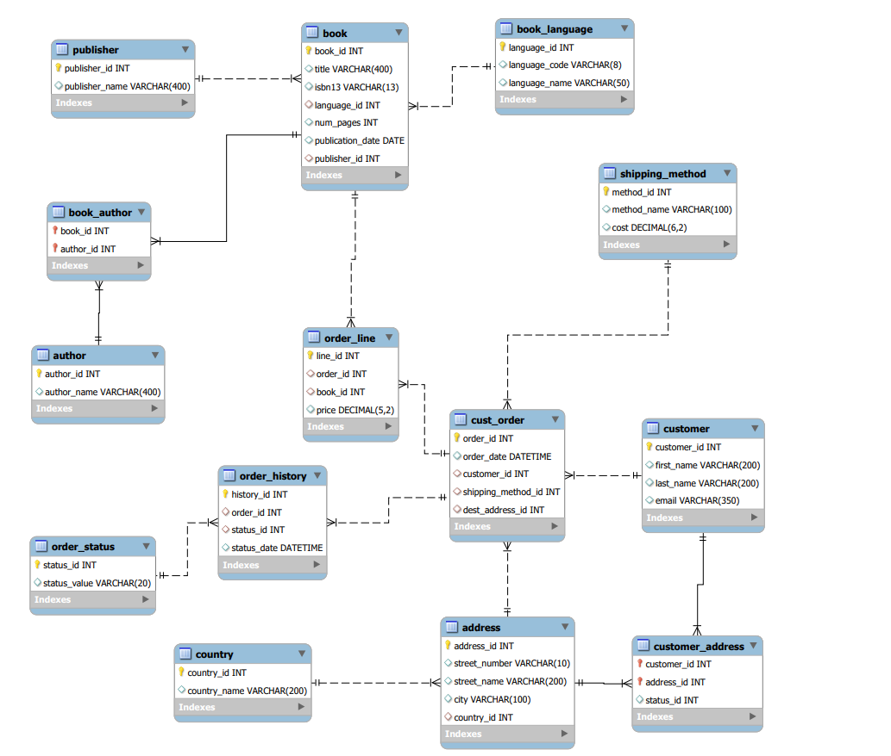

# Gravity Bookstore SQL

Este es un proyecto de base de datos para una biblioteca
 La base de datos contiene información sobre los Libros y Autores. Posteriormente 

 realizaremos una aplicación en Java para que nuestro cliente pueda gestionar los libros.

Las operaciones que debe realizar son las siguientes:

1- Listado de Libros con su autor

2- Búsqueda de libros por autor 

3- Búsqueda de libros por ISBN

4- Modificar los datos del libro
 
5- Dar de baja un libro

## Sección bbdd



Vemos aqui el diagrama de la base de datos relacional .sql La editamos con My workbench y Heidi
y podemos hacer consultas usando la tabla de forma normalizada y no redundante. Para conseguir los resultados deseados.

Creamos las tablas relacionadas generanado un codigo como este de ejemplo:

``` 
DROP TABLE IF EXISTS `cust_order`;
/*!40101 SET @saved_cs_client     = @@character_set_client */;
/*!50503 SET character_set_client = utf8mb4 */;
CREATE TABLE `cust_order` (
  `order_id` int NOT NULL AUTO_INCREMENT,
  `order_date` datetime DEFAULT NULL,
  `customer_id` int DEFAULT NULL,
  `shipping_method_id` int DEFAULT NULL,
  `dest_address_id` int DEFAULT NULL,
  PRIMARY KEY (`order_id`),
  KEY `fk_order_cust` (`customer_id`),
  KEY `fk_order_ship` (`shipping_method_id`),
  KEY `fk_order_addr` (`dest_address_id`),
  CONSTRAINT `fk_order_addr` FOREIGN KEY (`dest_address_id`) REFERENCES `address` (`address_id`),
  CONSTRAINT `fk_order_cust` FOREIGN KEY (`customer_id`) REFERENCES `customer` (`customer_id`),
  CONSTRAINT `fk_order_ship` FOREIGN KEY (`shipping_method_id`) REFERENCES `shipping_method` (`method_id`)
) ENGINE=InnoDB AUTO_INCREMENT=11448 DEFAULT CHARSET=utf8mb4 COLLATE=utf8mb4_0900_ai_ci;
````


El fichero completo esta siguiendo este Link:

[Script para la creación de la BBDD de le empresa Gravity](C:\Users\in_admin\Desktop\ejemplofork\gravityforms.sql)

## Operaciones Necesarias

Realizamos las operaciones necesarias mediante usando sql. mediante codigo como el del ejemplo.
Las operaciones que debe realizar son las siguientes:

1 Listado de Libros por su autor

###BUSCA POR ID DEL AUTOR
```
select

b.book_id id,
title,
author_name,
ba.author_id
from book b join book_author ba on b.book_id=ba.book_id 
join author a on a.author_id= ba.author_id
where ba.author_id=79
order by author_id asc


```
 Siguiendo este Link se pueden encontrar el Script para las operaciones deseadas:
 
 [Script para las Operaciones](C:\Users\in_admin\Desktop\ejemplofork\gravityselect.sql)
 
 
 Los ficheros se pueden importar directamente mediante los gestores sql y ejecutarlos.
 
 
 
